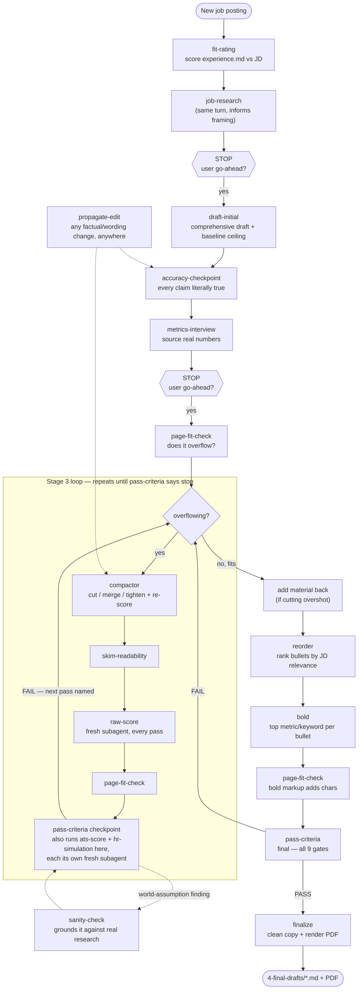

# Resume Builder — Quick Start

A pipeline for turning one master experience file into job-tailored,
ATS-safe resumes — with Claude doing the tailoring and scoring at each step.
Full rules live in [CLAUDE.md](CLAUDE.md); this file is just "how do I use
this today."

> **This pipeline is deliberately token-usage heavy.** Fresh, context-blind
> subagents re-score every draft from multiple independent angles (rubric
> fit, ATS parseability, a simulated recruiter read), compaction runs in
> small verified passes instead of one big rewrite, and every claim gets a
> literal accuracy check before it ships. That cost is intentional, not
> accidental complexity — getting a resume past both an ATS filter and a
> human skim is a genuinely hard problem, and the repeated, independent
> verification is what buys the accuracy and quality bar. If you're
> skimming this repo, the heavy machinery below is the point, not
> over-engineering.

## Setup (one-time)

1. Open this folder in Claude Code.
2. Fill in `0-experience/experience.md` with everything about your
   background: jobs, projects, metrics, skills, education. Don't worry
   about formatting or resume-speak — bullet-dump it, Claude will do the
   phrasing later. The one rule: only put things here that actually
   happened. Everything downstream traces back to this file.

That's it. You don't touch anything else by hand — the folders below fill
in automatically as you go.

## Applying to a job

Tell Claude something like:

> "Here's a job posting: [paste the text or link]. Start a new
> application for it."

Claude will then walk the pipeline **one gated stage at a time**, stopping
after each one for your go-ahead:

1. **Fit Rating** — saves the job posting to `1-job-descriptions/`, scores
   how well `experience.md` matches it (out of 10, with a breakdown and a
   list of gaps), and tells you whether it's worth pursuing. *Stops here.*
2. **Initial Draft** — say "proceed" and Claude pulls every relevant piece
   of experience into `2-initial-drafts/`. This one's long on purpose — a
   quarry, not a final resume. Check it for anything missing or wrong.
   *Stops here.*
3. **Accuracy & Metrics Interview** — once you confirm the draft, Claude
   interviews *you*: it walks through every claim that could be read as
   overstated (verb strength, attribution, unproven skills-line entries)
   and asks for the real numbers behind any bullet that's currently
   unquantified. "I don't remember" is a fine answer — nothing gets
   invented to fill a gap. Approved corrections and metrics get written
   back into `0-experience/experience.md` itself, so they're captured for
   every future application, not just this one. This runs **before**
   compaction on purpose, so wording only gets tightened once. *Stops
   here.*
4. **Compaction** — say "compact it" and Claude tightens the draft in
   `3-compact-drafts/` over a few passes, re-scoring after each one so it
   never trades away fit for brevity.
5. **Final** — once compaction is done, the winning version lands in
   `4-final-drafts/`, clean and ready to submit.

## Full pipeline flow

The four stages above are what you see; underneath, each one is a
sequence of atomic skills that gate and re-verify each other. This is
the full picture — solid arrows are the normal path, dashed arrows are
conditional/cross-cutting skills that fire on top of it.

Two things worth calling out in that diagram:

- **Gates 1–3 of `pass-criteria`** (`raw-score`, `ats-score`,
  `hr-simulation`) each run as their own **fresh subagent** with no
  memory of this conversation — that's what makes them independent
  reads rather than the same context agreeing with itself three times.
  A strong result on one never offsets a fail on another, so all three
  have to clear their own threshold before the loop can end.
- **`sanity-check` only fires when a finding is really a guess about the
  outside world** (a seniority bar, a company norm) rather than something
  literally checkable in the JD or draft text — most checkpoints trigger
  nothing.

## Things to know

- Claude will **never invent** experience, skills, or metrics — if a job
  wants something `experience.md` doesn't support, it says so as a gap
  instead of papering over it.
- Claude **won't skip ahead** — each stage ends with a stop-and-wait, even
  if you're impatient to see the final version. Say the word and it moves
  on.
- If a score looks off, ask Claude to explain the breakdown — it's
  computed from a fixed rubric (not a vibe), so it can always show its
  work.
- Nothing here is shared automatically. Every job you apply to lives in
  its own file per stage, named after the company and role.
